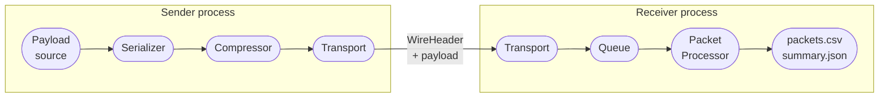

# pb-tool — Protocol Benchmarking Tool

[](LICENSE)

Cross-machine benchmarking framework for IoT/mobility communication protocols. Measures end-to-end latency, jitter, packet loss, and throughput across the full serialization + compression + transport pipeline, with nanosecond-resolution timestamps and NTP-corrected cross-machine delay.

## Overview

pb-tool runs as two separate processes — a **Sender** and a **Receiver** — typically on different machines, correlated by a shared `--run-id`. Every message flows through a configurable pipeline of serialization → compression → transport before crossing the network, and the Receiver reconstructs per-packet timing for each stage.

> **Cross-machine clock note:** all timestamps use `std::chrono::system_clock` (Unix epoch), the only standard clock the NTP offset correction can be applied against. Earlier builds used `std::chrono::high_resolution_clock`, which is implementation-defined — it aliases `system_clock` on libc++/macOS but `steady_clock` (boot-time epoch, not wall-clock) on libstdc++/Linux, silently producing nonsensical multi-year `e2e_delay_us` values on mixed-OS runs. If you see astronomically large or negative `e2e_delay_us`, rebuild both Sender and Receiver from a version including this fix (`include/pbt/core/Types.hpp`).
>
> **Still seeing negative `e2e_delay_us` on loopback/LAN runs?** That's SNTP measurement noise, not a bug — a single NTP exchange has an offset error of hundreds of µs to several ms, which can exceed the actual transit delay on fast paths. See [`docs/ntp-sync.md`](docs/ntp-sync.md) for the full explanation and the mitigations below (multi-sample sync, `--ntp-skip-loopback`, `--ntp-server`, sync-uncertainty reporting).



### Supported combinations

| Layer | Options |
|-------|---------|
| **Transport** | `tcp` · `udp` (app-level fragmentation) · `zmq_tcp` (PUSH/PULL or PUB/SUB) · `mqtt_tcp` (QoS 0/1/2) |
| **Serializer** | `none` (raw bytes passthrough) · `cbor` · `protobuf` |
| **Compressor** | `none` · `zstd` · `zstd` + pre-trained dictionary |
| **Payload** | `random` · `text` · `json` · `yaml` · `kv` · `binary` (file-backed, cycled) |

Any transport can be paired with any serializer and any compressor — giving **12 protocol-stack combinations** out of the box.

### What you can measure

| Goal | How |
|------|-----|
| Compare TCP vs ZMQ latency | Two runs with same `--rate` / `--payload-size`, different `--protocol` |
| Cost of Protobuf + Zstd | Run `none/none` vs `protobuf/zstd` — compare `serialization_us` + `compression_us` |
| UDP packet loss at high rates | `--protocol udp --rate 5000` — check `packet_loss_pct` in `summary.json` |
| MQTT QoS overhead | Three runs with `--mqtt-qos 0/1/2` — compare `e2e_delay_us` distributions |
| Dictionary compression on small payloads | `--compression zstd` vs `--compression zstd --zstd-dict dict.zstd` |
| Warmup vs steady-state latency | `--warmup 5` excludes JIT/buffer fill from statistics |

### Output per run

```
results/test01_tcp_none_none/
├── config.json      ← full configuration snapshot (reproducibility record)
├── packets.csv      ← one row per packet: all timestamps + derived latencies
└── summary.json     ← mean / p50 / p95 / p99 / p99.9 for each pipeline stage
```

`summary.json` latency breakdown example:

```json
"latency": {
  "e2e":             { "mean_us": 2044, "p95_us": 2250, "p99_us": 2358 },
  "serialization":   { "mean_us":    0, "p95_us":    0, "p99_us":    0 },
  "compression":     { "mean_us":    0, "p95_us":    0, "p99_us":    0 },
  "transport":       { "mean_us": 2038, "p95_us": 2244, "p99_us": 2351 },
  "decompression":   { "mean_us":    0, "p95_us":    0, "p99_us":    0 },
  "deserialization": { "mean_us":    0, "p95_us":    0, "p99_us":    0 }
}
```

`summary.json` also reports the NTP sync quality behind that `e2e` block — read this before trusting an `e2e_delay_us` that's small, negative, or surprisingly variable run-to-run:

```json
"ntp": {
  "server": "127.0.0.1",
  "disabled": false,
  "sender_offset_ns": 45642065,
  "receiver_offset_ns": 45197637,
  "sender_uncertainty_ns": 210000,
  "receiver_uncertainty_ns": 185000,
  "sync_uncertainty_us": 395.0
}
```

`sync_uncertainty_us` is the ± band on `e2e_delay_us` coming from clock-sync error alone (sum of both sides' `uncertainty_ns`, converted to µs) — if it's comparable to or larger than the measured `e2e_delay_us` mean, the sign/magnitude of that mean isn't meaningful yet. `disabled: true` (`--no-ntp` on both sides, or a sender run with `--ntp-skip-loopback` against a loopback target) means no correction was applied or needed; offsets/uncertainty are then irrelevant.

### NTP sync

Every SNTP exchange has an offset error proportional to network path asymmetry — for a public server this is typically hundreds of µs to several ms, which can dominate (even invert the sign of) a loopback/LAN transit delay of only tens to hundreds of µs. See [`docs/ntp-sync.md`](docs/ntp-sync.md) for the full root-cause analysis and reproduction steps. Mitigations:

- **Multi-sample, min-RTT-filtered sync** (on by default) — 8 independent SNTP exchanges at startup, the lowest-RTT one kept (least path asymmetry). No flag needed.
- **`--ntp-skip-loopback`** (opt-in, off by default) — if `--host` resolves to a loopback address, the sender skips NTP entirely (same clock as the receiver, true offset is 0); the receiver is told via the wire header and ignores its own offset for that run too. Only needs to be passed to the sender.
- **`--ntp-server <host>`** (or `PBT_NTP_SERVER`) — use a specific NTP server. Without one, pb-tool probes `127.0.0.1` first (a local time daemon has a far more symmetric, lower-error path than a public server) and falls back to `pool.ntp.org` only if nothing answers:
  ```bash
  ./build/pb-tool --mode receiver --protocol tcp --port 7001 --ntp-server ntp.internal.lan --run-id r1
  ```
- **`--no-ntp`** — skip sync entirely (must be passed to both sides); raw `ts_received - ts_sent` is reported uncorrected.

### Analyzer

pb-tool ships with a standalone Python CLI tool (`analyzer/`) for visualizing and comparing runs without writing any code.

```
cd analyzer && uv run analyzer
```

It scans the `results/` directory, presents a numbered table of available runs, and — after you pick which ones to compare — generates **34 figures** (PNG + PDF) in a timestamped output folder:

| Figure type | What it shows |
|-------------|---------------|
| `hist_{dim}` × 6 | Latency distribution per pipeline stage (overlaid histograms) |
| `scatter_{dim}` × 6 | Per-packet latency vs elapsed time — every point plotted |
| `latency_summary` | Grouped bar chart: p50 / p95 / p99 / p99.9 across all stages |
| `reliability_throughput` | Packet loss, out-of-order count, throughput |
| `ts_e2e` / `ts_jitter` | Delay and jitter over time (scatter + rolling median) |
| `ts_throughput` | Bytes/s and msg/s in 1-second bins, twin axes |

Runs are only comparable if they share the same `message_rate_hz`, `payload_size_bytes`, and `duration_s` — mismatches cause a hard exit with a diff table. See [docs/analyzer.md](docs/analyzer.md) for full usage.

---

## Quick Start

```bash
# Build
cmake -B build -DCMAKE_BUILD_TYPE=Release
cmake --build build -j$(sysctl -n hw.logicalcpu)   # macOS
# cmake --build build -j$(nproc)                    # Linux

# Terminal 1 — Receiver (wait for [READY])
./build/app/pb-tool --mode receiver --protocol tcp --port 5555 --run-id test01

# Terminal 2 — Sender
./build/app/pb-tool --mode sender --protocol tcp \
  --host 127.0.0.1 --port 5555 \
  --payload-format random --payload-size 512 \
  --rate 500 --duration 10 --run-id test01

# Results in ./results/test01_tcp_none_none/
```

## Documentation

| Section | File |
|---------|------|
| General info & pipeline | [docs/overview.md](docs/overview.md) |
| Architecture & UML diagrams | [docs/architecture.md](docs/architecture.md) |
| Build | [docs/build.md](docs/build.md) |
| Running & CLI reference | [docs/running.md](docs/running.md) |
| NTP sync deep dive (root cause + mitigations) | [docs/ntp-sync.md](docs/ntp-sync.md) |
| Result analysis (Python) | [docs/analyzer.md](docs/analyzer.md) |
| Extending the tool | [docs/extending.md](docs/extending.md) |
| Architectural decisions | [docs/adr/](docs/adr/) |
| Glossary | [CONTEXT.md](CONTEXT.md) |
