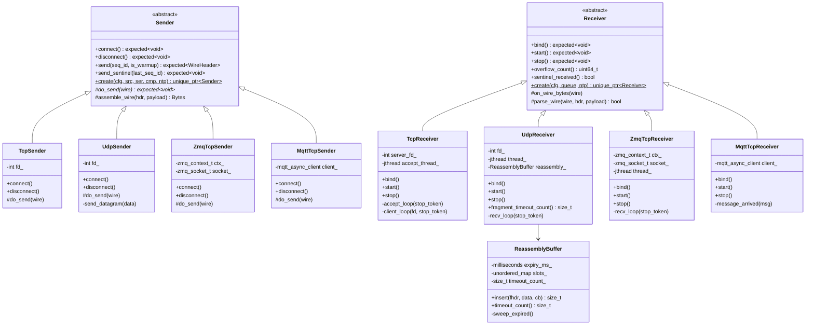
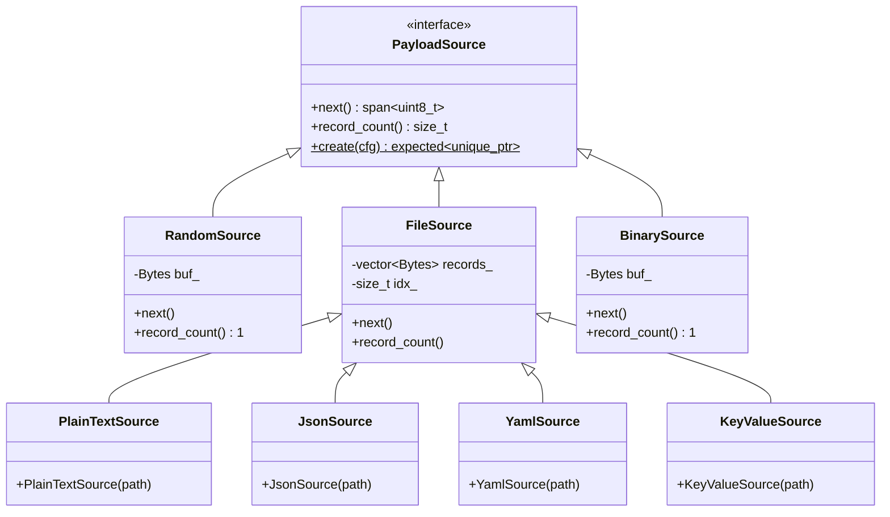
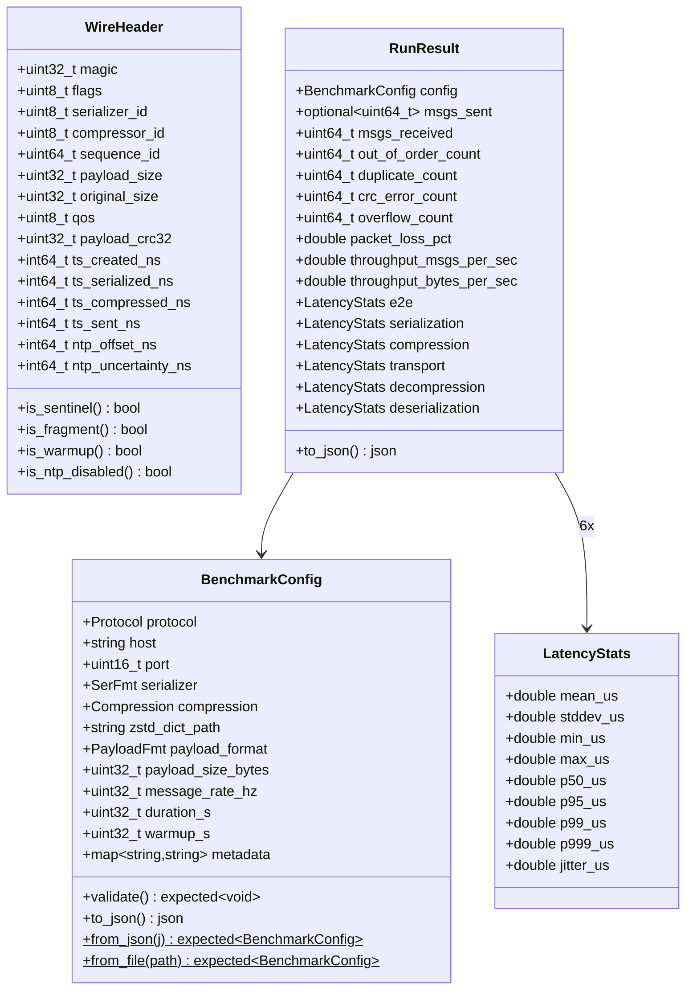
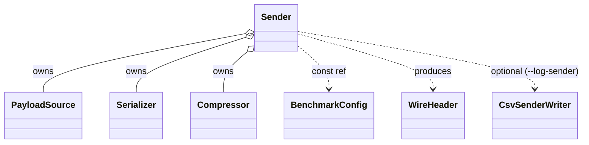
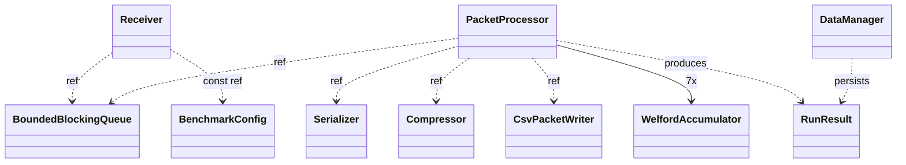
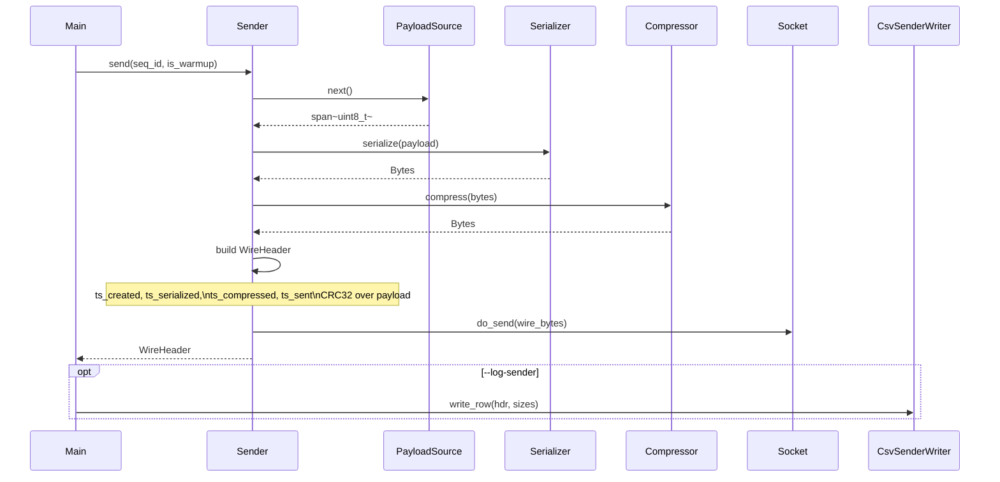
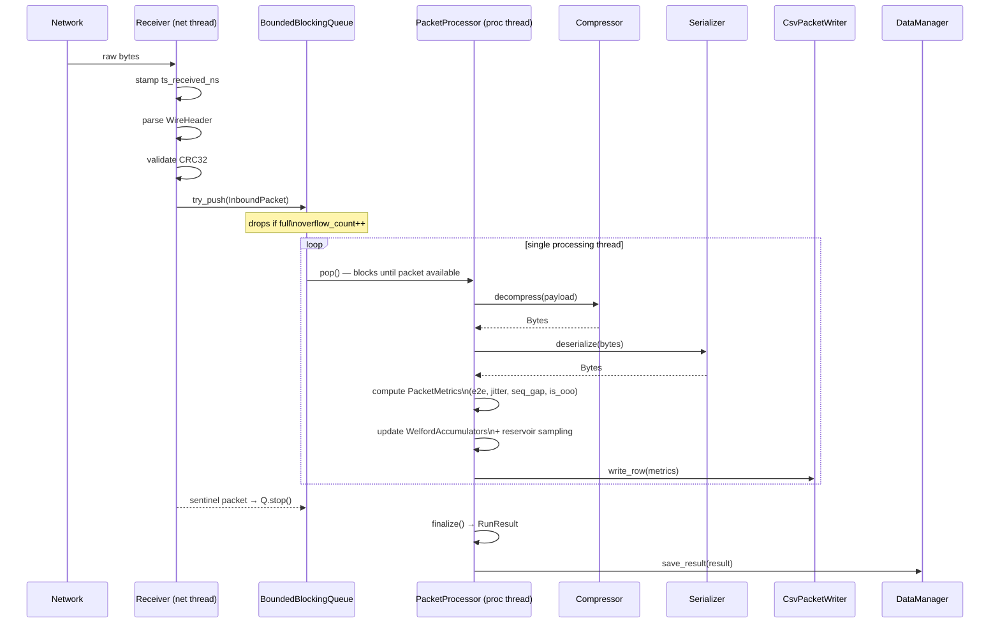
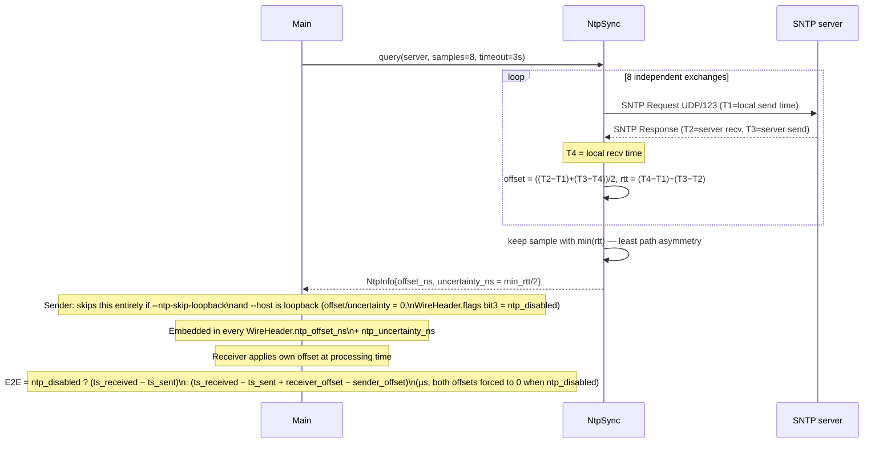
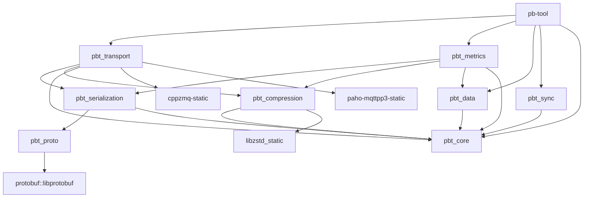

# Architecture

## Transport Layer

## Serialization & Compression

```mermaid
classDiagram
    class Serializer {
        <<interface>>
        +serialize(payload) expected~Bytes~
        +deserialize(data) expected~Bytes~
        +format() SerFmt
        +create(fmt, source_format)$ unique_ptr~Serializer~
    }
    class NoneSerializer {
        +serialize(p)
        +deserialize(d)
        +format() None
    }
    class CborSerializer {
        +serialize(payload)
        +deserialize(data)
        +format() Cbor
    }
    class ProtobufSerializer {
        -string source_format_
        +serialize(payload)
        +deserialize(data)
        +format() Protobuf
    }

    Serializer <|-- NoneSerializer
    Serializer <|-- CborSerializer
    Serializer <|-- ProtobufSerializer

    class Compressor {
        <<interface>>
        +compress(in) expected~Bytes~
        +decompress(in, original_size) expected~Bytes~
        +type() Compression
        +create(c, dict_path)$ unique_ptr~Compressor~
    }
    class NoopCompressor {
        +compress(in)
        +decompress(in, size)
        +type() None
    }
    class ZstdCompressor {
        -int level_
        -unique_ptr~ZSTD_CCtx~ cctx_
        -unique_ptr~ZSTD_DCtx~ dctx_
        -ZSTD_CDict* cdict_
        -ZSTD_DDict* ddict_
        +compress(in)
        +decompress(in, size)
        +type() Zstd
    }

    Compressor <|-- NoopCompressor
    Compressor <|-- ZstdCompressor
```

## Payload Sources

## Core Data Structures

## Runtime Composition

### Sender side

### Receiver side

## Sender Pipeline — Sequence Diagram

## Receiver Pipeline — Sequence Diagram

## NTP Clock Sync — Sequence Diagram

## CMake Module Dependency Graph

