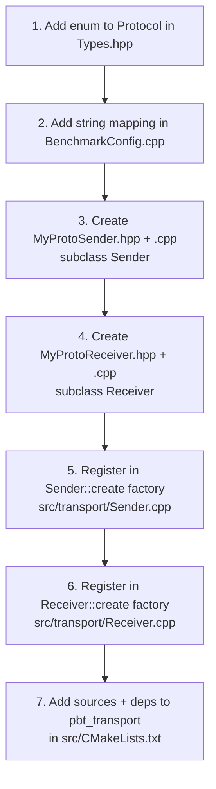
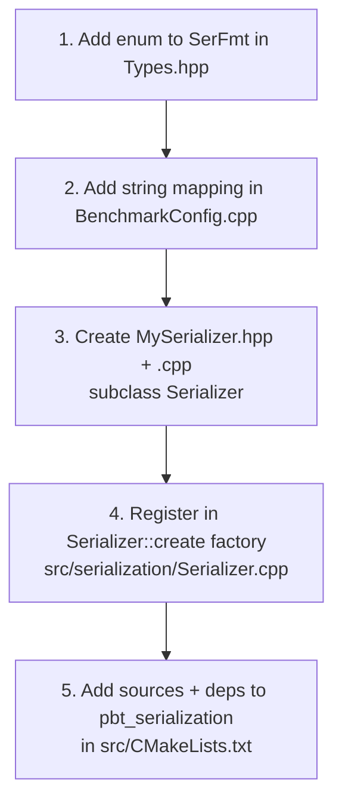
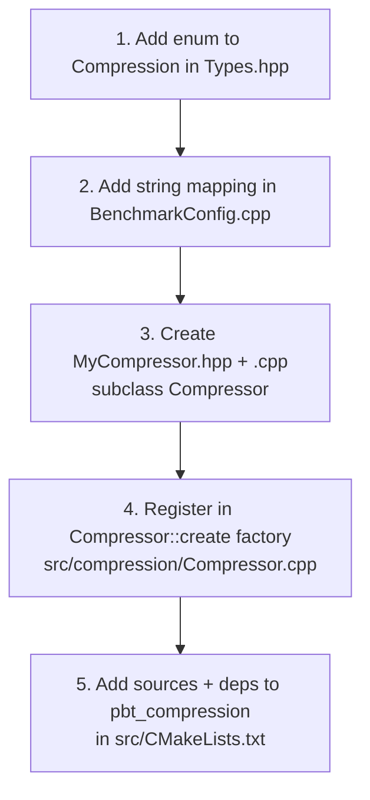

# Extending the Tool

The transport, serialization, and compression layers all use the same pattern:

1. **Abstract base class** defines the interface.
2. **Concrete subclass** implements the interface.
3. **`create()` factory function** in the base class selects the implementation at runtime.
4. **`Types.hpp`** holds the enum that identifies the implementation.
5. **`BenchmarkConfig.cpp`** maps enum values to/from strings (CLI, JSON).

The three layers are independent — adding a new serializer does not require touching transport code.

---

## Adding a New Transport Protocol

### What to implement

A new protocol requires one `Sender` subclass and one `Receiver` subclass.

**Sender interface** (see `include/pbt/transport/Sender.hpp`):

```cpp
class Sender {
protected:
    virtual std::expected<void, Error> do_send(const Bytes& wire) = 0;
public:
    virtual std::expected<void, Error> connect()    = 0;
    virtual std::expected<void, Error> disconnect() = 0;
};
```

`do_send` receives the fully assembled wire bytes (WireHeader + payload). The base class handles payload sourcing, serialization, compression, header construction, and CRC32 — the subclass only moves bytes to the socket.

**Receiver interface** (see `include/pbt/transport/Receiver.hpp`):

```cpp
class Receiver {
protected:
    void on_wire_bytes(const Bytes& wire);   // call this when a full message arrives
public:
    virtual std::expected<void, Error> bind()  = 0;
    virtual std::expected<void, Error> start() = 0;
    virtual std::expected<void, Error> stop()  = 0;
};
```

Call `on_wire_bytes` from your receive loop every time a complete message is received. The base class handles timestamp stamping, CRC validation, queue insertion, and sentinel detection.

### Checklist



**Step 1** — `include/pbt/core/Types.hpp`:

```cpp
enum class Protocol : uint8_t {
    MqttTcp = 0,
    ZmqTcp  = 1,
    Tcp     = 2,
    Udp     = 3,
    MyProto = 4,   // ← add here
};
```

**Step 2** — `src/core/BenchmarkConfig.cpp`:

```cpp
// in to_string(Protocol)
case Protocol::MyProto: return "my_proto";

// in protocol_from_string()
if (s == "my_proto") return Protocol::MyProto;
```

**Step 3** — `include/pbt/transport/MyProtoSender.hpp`:

```cpp
#pragma once
#include <pbt/transport/Sender.hpp>

class MyProtoSender final : public pbt::Sender {
public:
    explicit MyProtoSender(const pbt::BenchmarkConfig& cfg,
                           std::unique_ptr<pbt::PayloadSource> src,
                           std::unique_ptr<pbt::Serializer> ser,
                           std::unique_ptr<pbt::Compressor> cmp,
                           int64_t ntp_offset_ns = 0);
    ~MyProtoSender() override;

    std::expected<void, pbt::Error> connect()    override;
    std::expected<void, pbt::Error> disconnect() override;

protected:
    std::expected<void, pbt::Error> do_send(const pbt::Bytes& wire) override;

private:
    // transport-specific state (socket fd, client handle, etc.)
};
```

**Step 4** — `include/pbt/transport/MyProtoReceiver.hpp`:

```cpp
#pragma once
#include <pbt/transport/Receiver.hpp>

class MyProtoReceiver final : public pbt::Receiver {
public:
    explicit MyProtoReceiver(const pbt::BenchmarkConfig& cfg,
                             pbt::BoundedBlockingQueue<pbt::InboundPacket>& queue,
                             int64_t ntp_offset_ns = 0);
    ~MyProtoReceiver() override;

    std::expected<void, pbt::Error> bind()  override;
    std::expected<void, pbt::Error> start() override;
    std::expected<void, pbt::Error> stop()  override;

private:
    void recv_loop(std::stop_token tok);
    std::jthread thread_;
    // transport-specific state
};
```

**Step 5** — `src/transport/Sender.cpp`, inside `Sender::create()`:

```cpp
case Protocol::MyProto:
    return std::make_unique<MyProtoSender>(cfg, std::move(src),
                                           std::move(ser), std::move(cmp),
                                           ntp_offset_ns);
```

**Step 6** — `src/transport/Receiver.cpp`, inside `Receiver::create()`:

```cpp
case Protocol::MyProto:
    return std::make_unique<MyProtoReceiver>(cfg, queue, ntp_offset_ns);
```

**Step 7** — `src/CMakeLists.txt`:

```cmake
target_sources(pbt_transport PRIVATE
    # existing sources ...
    MyProtoSender.cpp
    MyProtoReceiver.cpp
)
target_link_libraries(pbt_transport PUBLIC
    # existing deps ...
    my_proto_library
)
```

---

## Adding a New Serializer

### What to implement

The `Serializer` interface (see `include/pbt/serialization/Serializer.hpp`):

```cpp
class Serializer {
public:
    virtual std::expected<Bytes, Error> serialize(std::span<const uint8_t> payload) = 0;
    virtual std::expected<Bytes, Error> deserialize(std::span<const uint8_t> data)  = 0;
    virtual SerFmt format() const noexcept = 0;
};
```

`serialize` receives raw payload bytes and returns encoded bytes. `deserialize` is the inverse. The Sender calls `serialize` before compression; the Receiver calls `deserialize` after decompression.

### Checklist



**Step 1** — `include/pbt/core/Types.hpp`:

```cpp
enum class SerFmt : uint8_t {
    None     = 0,
    Cbor     = 1,
    Protobuf = 2,
    MyFmt    = 3,   // ← add here
};
```

**Step 2** — `src/core/BenchmarkConfig.cpp`:

```cpp
case SerFmt::MyFmt: return "my_fmt";
// and in ser_from_string():
if (s == "my_fmt") return SerFmt::MyFmt;
```

**Step 3** — `include/pbt/serialization/MySerializer.hpp`:

```cpp
#pragma once
#include <pbt/serialization/Serializer.hpp>

class MySerializer final : public pbt::Serializer {
public:
    std::expected<pbt::Bytes, pbt::Error>
    serialize(std::span<const uint8_t> payload) override;

    std::expected<pbt::Bytes, pbt::Error>
    deserialize(std::span<const uint8_t> data) override;

    pbt::SerFmt format() const noexcept override { return pbt::SerFmt::MyFmt; }
};
```

**Step 4** — `src/serialization/Serializer.cpp`, inside `Serializer::create()`:

```cpp
case SerFmt::MyFmt:
    return std::make_unique<MySerializer>();
```

**Step 5** — `src/CMakeLists.txt`:

```cmake
target_sources(pbt_serialization PRIVATE
    # existing ...
    MySerializer.cpp
)
target_link_libraries(pbt_serialization PUBLIC
    my_serialization_lib   # if needed
)
```

---

## Adding a New Compressor

### What to implement

The `Compressor` interface (see `include/pbt/compression/Compressor.hpp`):

```cpp
class Compressor {
public:
    virtual std::expected<Bytes, Error> compress(std::span<const uint8_t> in) = 0;
    virtual std::expected<Bytes, Error> decompress(std::span<const uint8_t> in,
                                                   uint32_t original_size) = 0;
    virtual Compression type() const noexcept = 0;
};
```

`compress` runs on the Sender after serialization. `decompress` runs on the Receiver before deserialization. `original_size` (from `WireHeader.original_size`) is provided to `decompress` for pre-allocation.

### Checklist



**Step 1** — `include/pbt/core/Types.hpp`:

```cpp
enum class Compression : uint8_t {
    None  = 0,
    Zstd  = 1,
    MyAlg = 2,   // ← add here
};
```

**Step 2** — `src/core/BenchmarkConfig.cpp`:

```cpp
case Compression::MyAlg: return "my_alg";
// and in compression_from_string():
if (s == "my_alg") return Compression::MyAlg;
```

**Step 3** — `include/pbt/compression/MyCompressor.hpp`:

```cpp
#pragma once
#include <pbt/compression/Compressor.hpp>

class MyCompressor final : public pbt::Compressor {
public:
    std::expected<pbt::Bytes, pbt::Error>
    compress(std::span<const uint8_t> in) override;

    std::expected<pbt::Bytes, pbt::Error>
    decompress(std::span<const uint8_t> in, uint32_t original_size) override;

    pbt::Compression type() const noexcept override { return pbt::Compression::MyAlg; }
};
```

**Step 4** — `src/compression/Compressor.cpp`, inside `Compressor::create()`:

```cpp
case Compression::MyAlg:
    return std::make_unique<MyCompressor>();
```

**Step 5** — `src/CMakeLists.txt`:

```cmake
target_sources(pbt_compression PRIVATE
    # existing ...
    MyCompressor.cpp
)
target_link_libraries(pbt_compression PUBLIC
    my_compression_lib   # if needed
)
```

---

## Where Each New Class Plugs In

The diagram below highlights the three extension points relative to the full class hierarchy:

```mermaid
classDiagram
    class Sender { <<abstract>> }
    Sender <|-- TcpSender
    Sender <|-- UdpSender
    Sender <|-- ZmqTcpSender
    Sender <|-- MqttTcpSender
    Sender <|-- MyProtoSender:::new

    class Receiver { <<abstract>> }
    Receiver <|-- TcpReceiver
    Receiver <|-- UdpReceiver
    Receiver <|-- ZmqTcpReceiver
    Receiver <|-- MqttTcpReceiver
    Receiver <|-- MyProtoReceiver:::new

    class Serializer { <<interface>> }
    Serializer <|-- NoneSerializer
    Serializer <|-- CborSerializer
    Serializer <|-- ProtobufSerializer
    Serializer <|-- MySerializer:::new

    class Compressor { <<interface>> }
    Compressor <|-- NoopCompressor
    Compressor <|-- ZstdCompressor
    Compressor <|-- MyCompressor:::new

    classDef new fill:#d4edda,stroke:#28a745,color:#000
```
