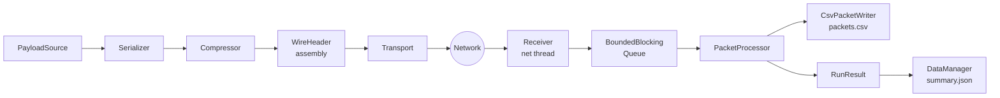

# Overview

## What is pb-tool?

**pb-tool** is a cross-machine benchmarking framework for IoT and intelligent-mobility communication protocols. It measures end-to-end latency, jitter, packet loss, and throughput across the full serialization + compression + transport pipeline, with nanosecond-resolution timestamps and NTP-corrected cross-machine delay.

## Two-process Model

Every benchmark run consists of two independent processes — a **Sender** and a **Receiver** — typically deployed on different machines and correlated by a shared `--run-id`.

```
┌─────────────────────────────┐         ┌──────────────────────────────┐
│           SENDER            │         │           RECEIVER           │
│                             │         │                              │
│  PayloadSource              │         │  Network thread              │
│       ↓                     │         │    stamps ts_received_ns     │
│  Serializer                 │─────────▶   validates CRC32           │
│       ↓                     │  wire   │    pushes InboundPacket      │
│  Compressor                 │ bytes   │         ↓                    │
│       ↓                     │         │  BoundedBlockingQueue        │
│  WireHeader assembly        │         │         ↓                    │
│  (timestamps + CRC32)       │         │  PacketProcessor             │
│       ↓                     │         │    decompress → deserialize  │
│  Transport (send)           │         │    compute metrics           │
│                             │         │    write packets.csv         │
└─────────────────────────────┘         │         ↓                    │
                                        │  DataManager                 │
                                        │    summary.json + config.json│
                                        └──────────────────────────────┘
```

## Processing Pipeline



## Supported Combinations

| Transport | Serializer | Compressor |
|-----------|-----------|------------|
| Raw TCP | None (passthrough) | None |
| Raw UDP (+ app-level fragmentation) | CBOR | Zstd (standard) |
| ZeroMQ TCP (PUSH/PULL or PUB/SUB) | Protobuf | Zstd + pre-trained dictionary |
| MQTT v3.1.1 over TCP | | |

## Wire Format

Every message on the wire is:

```
[ WireHeader (72 bytes) ][ compressed+serialized payload bytes ]
```

**WireHeader** (72 bytes, naturally aligned, enforced by `static_assert`):

| Field | Size | Description |
|-------|------|-------------|
| `magic` | 4 B | `'PBT1'` — identifies the protocol |
| `flags` | 1 B | bit0=sentinel, bit1=fragment, bit2=warmup |
| `serializer_id` | 1 B | identifies the serializer used |
| `compressor_id` | 1 B | identifies the compressor used |
| `padding` | 1 B | alignment |
| `sequence_id` | 8 B | monotonic message counter |
| `payload_size` | 4 B | compressed byte count following the header |
| `original_size` | 4 B | uncompressed byte count |
| `qos` | 1 B | MQTT QoS (0/1/2), 0 for other protocols |
| `padding` | 3 B | alignment |
| `payload_crc32` | 4 B | CRC32 over compressed payload bytes |
| `ts_created_ns` | 8 B | nanosecond timestamp: payload generation |
| `ts_serialized_ns` | 8 B | nanosecond timestamp: after serialization |
| `ts_compressed_ns` | 8 B | nanosecond timestamp: after compression |
| `ts_sent_ns` | 8 B | nanosecond timestamp: just before socket write |
| `ntp_offset_ns` | 8 B | sender's SNTP clock offset vs. UTC |

**UDP fragmentation**: each datagram is further prefixed with a 24-byte `FragmentHeader` (`'PBTF'` magic, message ID, fragment index/count, data size). The receiver reassembles fragments before processing the `WireHeader`.

## NTP Clock Synchronisation

Both Sender and Receiver independently query an SNTP server at startup. The Sender embeds its offset in every `WireHeader.ntp_offset_ns`. The Receiver uses its own offset at processing time. End-to-End Delay is corrected as:

```
e2e_delay_us = (ts_received_ns − ts_sent_ns + ntp_offset_sender_ns − ntp_offset_receiver_ns) / 1000
```

Use `--no-ntp` if both machines share a hardware clock or PTP sync.

## Output Layout

Each run writes to:

```
results/{run_id}_{protocol}_{serializer}_{compression}/
├── config.json     — full configuration snapshot
├── packets.csv     — one row per received message (warmup excluded)
├── summary.json    — aggregated statistics (mean/p50/p95/p99/p99.9)
└── sender_log.csv  — optional, Sender side only (--log-sender)
```

The base directory is `./results` by default; override with `PBT_OUTPUT_DIR`.

## Further Reading

| Topic | File |
|-------|------|
| Class diagrams & sequence diagrams | [architecture.md](architecture.md) |
| Build instructions | [build.md](build.md) |
| Running & CLI reference | [running.md](running.md) |
| Result analysis (Python) | [analyzer.md](analyzer.md) |
| Adding protocols / serializers / compressors | [extending.md](extending.md) |
| Architectural decision records | [adr/](adr/) |
| Glossary (ubiquitous language) | [../CONTEXT.md](../CONTEXT.md) |
